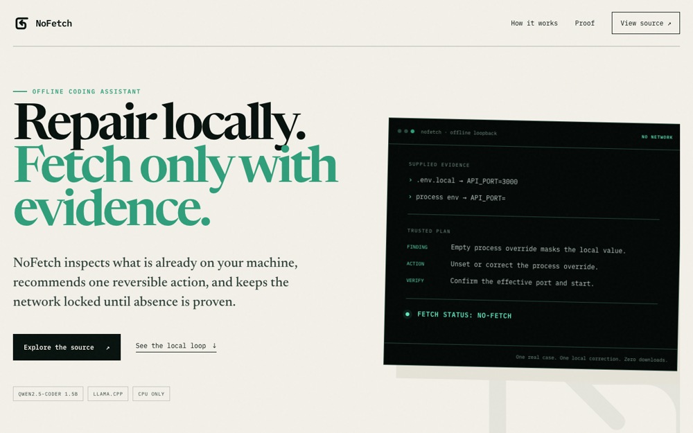
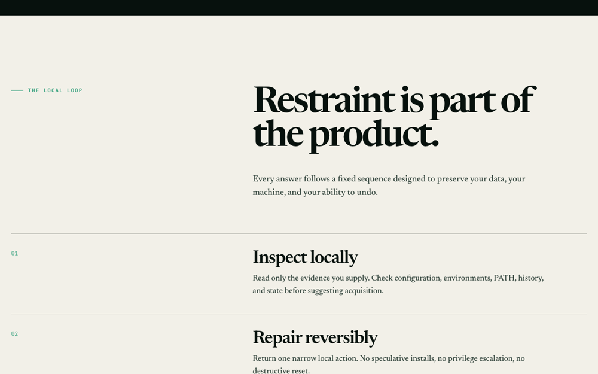
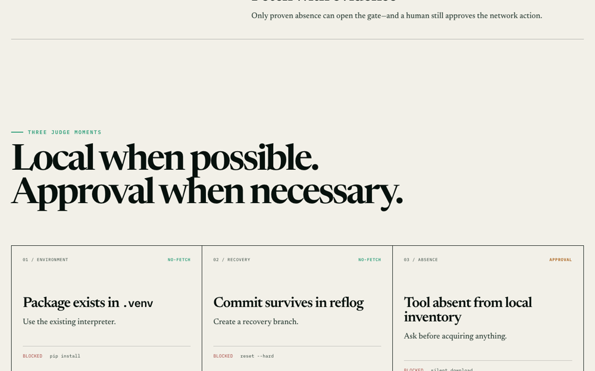
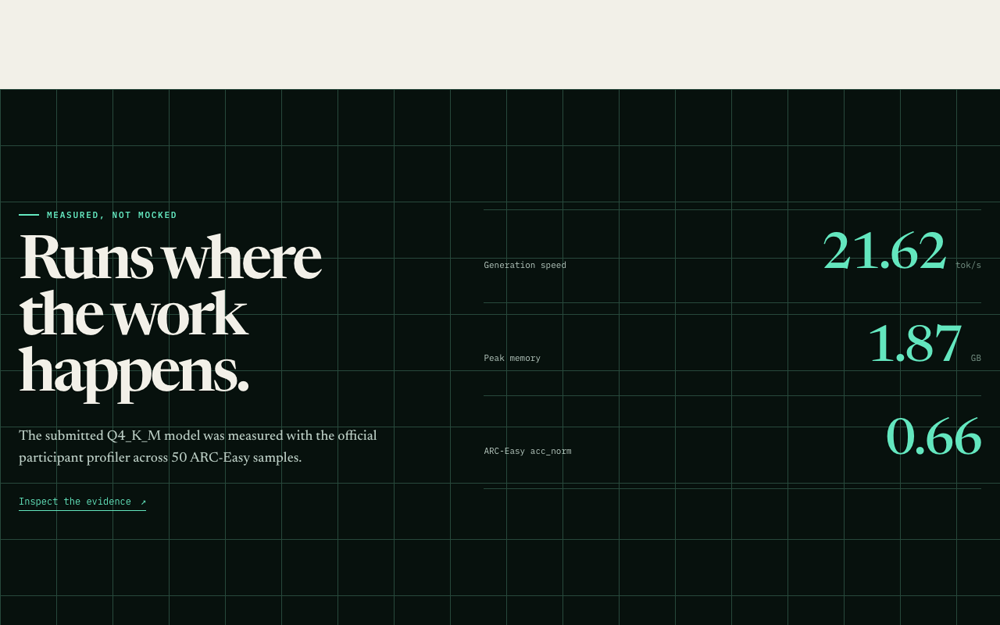

# NoFetch: Local debugging without the network reflex

NoFetch turns supplied evidence into one safe local repair before it considers a download.

[](https://nodejs.org/)
[](site/)
[](#testing-the-project)
[](LICENSE)



## Live Demo

**[nofetch.vercel.app](https://nofetch.vercel.app)**

Follow a real local diagnosis, inspect the fixed repair loop, and review measured profiler evidence.

## What Is NoFetch?

NoFetch is a CPU-only coding assistant for developers working with limited bandwidth or modest hardware. It accepts a bounded JSON case and talks only to a literal loopback `llama.cpp` endpoint. A deterministic playbook locks the repair, verification step, and fetch decision.

The local model can narrate the finding. It cannot replace the trusted action plan, execute commands, follow redirects, contact remote hosts, or approve a download.

## Screenshots

| Local repair loop | Guarded decisions |
|---|---|
|  |  |

| Measured profiler evidence |
|---|
|  |

## Features

- **Local-only inference:** Requests are restricted to literal IPv4 or IPv6 loopback addresses.
- **Evidence-first diagnosis:** The client accepts only a scenario, task, and bounded evidence list.
- **Reversible repairs:** Every matched case returns one narrow local action.
- **Fetch gate:** Acquisition requires proven absence and a separate human approval.
- **Deterministic fallback:** Trusted output remains available when model narration fails.
- **Fail-closed input handling:** Extra fields, malformed responses, redirects, and unsafe hosts are rejected.
- **Measured laptop performance:** The checked-in participant report records 21.62 generation tokens per second and 1868.49 MB peak RSS.
- **Dependency-free client:** The public CLI uses Node.js platform APIs only.

## Tech Stack

| Layer | Technology |
|---|---|
| Local model | Qwen2.5-Coder 1.5B Instruct, GGUF Q4_K_M |
| Inference runtime | llama.cpp at pinned commit `4df29be4f4c3673f428170fda944a5b19f743bb8` |
| CLI | Node.js ES modules |
| Trusted policy | Deterministic JavaScript playbook plus sealed system prompt |
| Landing page | Semantic HTML, CSS, and JavaScript |
| Verification | Node test runner and POSIX shell |
| Hosting | Vercel static deployment |

## Output Contract

```text
FINDING: <local cause only>
LOCAL ACTION: <one safe local action>
VERIFY: <local verification>
FETCH STATUS: <no-fetch or needs-approval>
```

The deterministic playbook fixes the action, verification, and fetch status. If narration is unavailable or malformed, the CLI prints the trusted playbook plan and emits a warning.

## How It Works

```text
Supplied JSON case
  |
  v
Strict schema and byte limits
  |
  v
Deterministic evidence playbook
  |                    \
  |                     +--> Locked local action
  |                     +--> Locked verification
  |                     +--> Locked fetch status
  v
Local llama.cpp narration
  |
  v
Alignment check and fallback
  |
  v
Trusted four-line plan
```

## Repository Layout

```text
app/                 Dependency-free CLI and deterministic playbook
baseline/            Sealed local system prompt
brand/               Production logo and social assets
docs/images/         Landing-page screenshots
model/               Ignored local GGUF destination
site/                Static landing page and its source tests
download_model.sh    Pinned model download and checksum verification
metadata.json        Submission metadata
submission.json      Participant profiler evidence
verify.sh            Offline repository contract
```

## Setup-Time Fetches and Local Build

Use Node.js 20 or newer. Run the following commands from the repository root. The clone and model download are setup-time network operations. Inference remains local afterward.

```sh
set -eu
llama_commit=4df29be4f4c3673f428170fda944a5b19f743bb8
runtime_root=.tools/llama.cpp
if test -e "$runtime_root" && ! test -d "$runtime_root/.git"; then
  echo "refusing non-checkout runtime path: $runtime_root" >&2; exit 1
fi
if ! test -d "$runtime_root"; then
  mkdir -p .tools
  git clone https://github.com/ggerganov/llama.cpp.git "$runtime_root"
fi
test "$(git -C "$runtime_root" remote get-url origin)" = https://github.com/ggerganov/llama.cpp.git
git -C "$runtime_root" fetch --depth 1 origin "$llama_commit"
git -C "$runtime_root" checkout --detach "$llama_commit"
test "$(git -C "$runtime_root" rev-parse HEAD)" = "$llama_commit"
cmake -S "$runtime_root" -B "$runtime_root/build" -DCMAKE_BUILD_TYPE=Release \
  -DGGML_METAL=OFF -DGGML_CUDA=OFF -DGGML_HIP=OFF -DGGML_OPENCL=OFF \
  -DGGML_SYCL=OFF -DGGML_VULKAN=OFF -DGGML_RPC=OFF -DLLAMA_CURL=OFF \
  -DLLAMA_BUILD_SERVER=ON
cmake --build "$runtime_root/build" --target llama-server -j4
./download_model.sh
```

The pinned source exposes each listed CMake option. The build enables the local CPU server. Its `--offline` mode prevents runtime network access. This pinned server does not expose a global system prompt flag. The Node client therefore sends
`baseline/system-prompt.txt` as the system message on every request.

## Local Inference

Start the server in one terminal:

```sh
.tools/llama.cpp/build/bin/llama-server --model model/qwen2.5-coder-1.5b-instruct-q4_k_m.gguf \
  --alias nofetch --host 127.0.0.1 --port 8080 --offline --ctx-size 2048
```

Create a local case in another terminal:

```sh
cat > case.json <<'JSON'
{"scenario":"build fails","task":"diagnose","evidence":["config/.env.local: API_PORT=4100","loader reads config/.env.local","process environment API_PORT=","effective config: invalid port"]}
JSON
node app/nofetch.mjs --input case.json --host http://127.0.0.1:8080
```

## Run the Landing Page

```sh
python3 -m http.server 4173
```

Open `http://127.0.0.1:4173/site/`.

## Testing the Project

Run the CLI contract tests:

```sh
node --test app/nofetch.test.mjs app/playbook.test.mjs
```

Run the landing-page source tests:

```sh
node --test site/landing.test.mjs
```

Run the sealed repository verification:

```sh
./verify.sh
```

The tests do not require a model download. CLI tests bind temporary loopback ports.

## Evidence Limits

`submission.json` records a participant-laptop run on Darwin x86_64. The model generated 21.62 tokens per second, used 1868.49 MB peak RSS, and scored 0.66 `acc_norm` across 50 ARC-Easy samples with seed 42.

These measurements are not Standard Laptop evidence or official challenge scores. Ubuntu 22.04 x86-64 validation and the hidden judge evaluation remain pending.

## License

NoFetch is distributed under the GNU General Public License v3.0. See [LICENSE](LICENSE).
